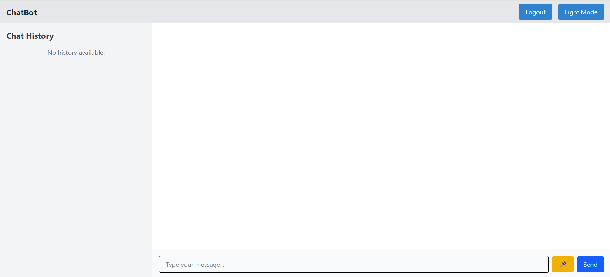
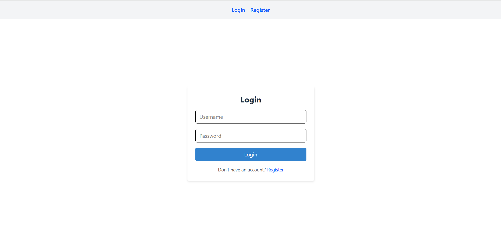
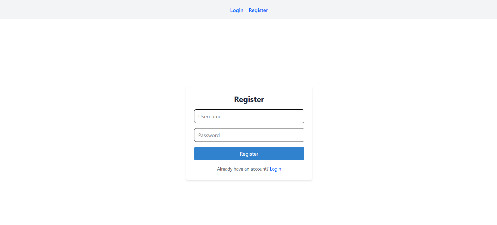

# zerocode-fe-assignment

# ZeroCode Chatbot Web Application

This is a production-ready chatbot web application built with **React** + **Vite** and **Tailwind CSS**. It includes secure authentication, real-time chat interface, dark/light mode toggle, and bonus features like voice input and typing indicator.

## 🚀 Features

- ✅ JWT-based Register & Login flow
- 💬 Real-time message stream between user and bot
- 🧠 Connected to a public LLM endpoint (HuggingFace)
- 💡 Auto-scroll, persistent chat history, and typing indicator
- 🌗 Light and Dark mode support
- 🎙️ Voice input (bonus feature)

## Authentication

As the application uses browser local storage to manage user sessions and data, users must register with a        username and password before they can log in and interact with the chatbot interface.

## 🛠️ Setup Instructions

1. **Clone the repository**

git clone https://github.com/YashPatel2754/zerocode-fe-assignment
cd zerocode-fe-assignment

2. **Install dependencies**

npm install

3. **Start the development server**

npm run dev

4. **Lint & Format **

npm run lint
npm run format

Note: Update your environment variables if needed.

## 🧱 Architecture Diagram

React (TypeScript)
│
├── Authentication (Login/Register)
│
├── Chat Interface
│   ├── Message display
│   ├── Input + Voice Input
│   └── Bot response via HuggingFace
│
├── Theme Context (Dark/Light mode)
│
└── LocalStorage for message history

## 📸 Screenshots

## 🌐 Live Demo

[Click here to open the chatbot app](https://zerocode-fe-assignment-three.vercel.app)

## 🔐 Test Credentials

Username: kminchelle
Password: 0lelplR

Use these to login dummy auth.

## 📁 Folder Structure

src/
├── assets/
├── components/
├── context/
├── pages/
├── styles/
└── utils/

## 📌 Tech Stack

- React
- Tailwind CSS
- React Router
- HuggingFace API
- Vite

## 🙏 Acknowledgements

- HuggingFace Inference API
- Vercel for deployment